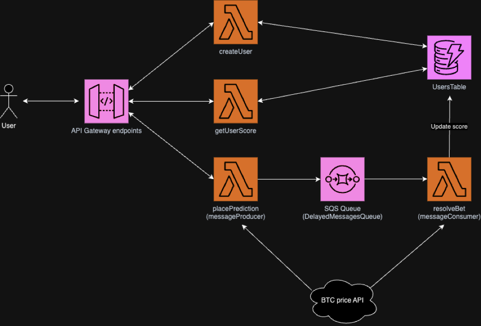

# BTC Price Prediction Project - Backend

This README contains instructions on how to use the backend part of the BTC price prediction project.

[App URL](https://d386ooxqoh3yz8.cloudfront.net).

## Project Overview and Architecture

The project was created using AWS technologies, including **API Gateway, Lambdas, DynamoDB, SQS**, and was deployed with **AWS CDK**.

The [app](https://d386ooxqoh3yz8.cloudfront.net) is currently hosted on **S3**.

The aim was to develop a system that allows users to make predictions on the price of BTC one minute into the future. API Gateway exposes several endpoints covering main functionality such as generating a user ID, retrieving user details and score, and placing a prediction.

Several Lambdas were deployed to handle the functionality of the API. For example, the `createUser` lambda generates a random UUID and checks if it hasn’t been assigned to another user yet. The `getUserScore` retrieves the user’s status and current score as a response.

The prediction mechanism is handled by the `messageProducer` (to place a prediction) and `messageConsumer` (to resolve it). The 1-minute timeframe of the prediction is generated by the `SQS queue`, which has a delay of 1 minute before sending events to the consumer.

### Making a prediction

Whenever a user makes a prediction, the current BTC price is fetched from a public API and is sent in an event format alongside the direction of the prediction and the userID who placed it to the SQS queue.

The queue waits for 1 minute before sending the event to the consumer. When the consumer receives the event containing the BTC price at the time of the prediction and the prediction itself, it fetches the BTC price again, compares it to the prediction, and updates the score of the user with the provided ID in the DynamoDB table of users.

The project was deployed with AWS CDK to a personal AWS account.

## Deployment

### Prerequisites

In order to deploy this project you will need to have **AWS CDK and CLI** installed. Once that is done, you will need to specify the access point by configuring the **Access Key Id** and **Secret Access Key** from your AWS account.

This README will not cover the instructions on how to do this, but they can be followed in this [detailed article (Steps 1-4)](https://medium.com/geekculture/how-i-used-cloud-development-kit-to-deploy-my-first-aws-infrastructure-beginner-level-9f00a527cc9a).

### Deployment Steps

1. Run `npm i` at the root level to install all modules used for deployment.
2. Run `npm i` in the `src/lambdas` folders to install the modules used by the Lambdas.
3. Run `npm run build` at the root level to build the project.
4. Run `cdk synth` to view the CloudFormation template of the project’s stack.
5. Run `cdk bootstrap`.
6. Run `cdk deploy` to deploy the stack to AWS.

If successful, the console will output the root URL for the project’s API. Copy and paste that into the constants folder of the frontend repository to use your own deployment. ()

## Future Plans

Similar to the frontend part, time constraints limited the scope of this project. Future plans include:

- **Unit Testing**: Use Jest to create unit tests for the utils functions, lambda handlers, and to check if the AWS stack is successfully deployed.
- **Automated Build and Deployment**: Utilize git actions or an alternative to build and redeploy the project programmatically.
- **User Authentication and Authorization**: AWS Cognito could be used to handle user authentication and authorisation. This could ensure security for the API requests, as well as provide a better authentication mechanism for the FE than simply utilising local storage to save user IDs.

## Frontend

The frontend repository can be accessed at [this URL](https://github.com/DavidCandreanu00/BTC-Price-predictor-FE).

## Useful commands

* `npm run build`   compile typescript to js
* `npm run watch`   watch for changes and compile
* `cdk deploy`      deploy this stack to your default AWS account/region
* `cdk diff`        compare deployed stack with current state
* `cdk synth`       emits the synthesized CloudFormation template
